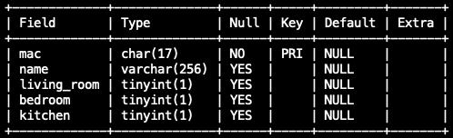

# CO657 IoT Admin Web App

A simple web interface for managing BLE device information stored in a database for an IoT System.

MySQL database table structure:

Implemented alongside a wider IoT system, check out the other aspects of this IoT system:

- <a href="https://github.com/d-w-arnold/bluetooth-IoT-device/" target="_blank">IoT Device</a>

- <a href="https://github.com/d-w-arnold/CO657-IoT-server/" target="_blank">IoT Server</a>
